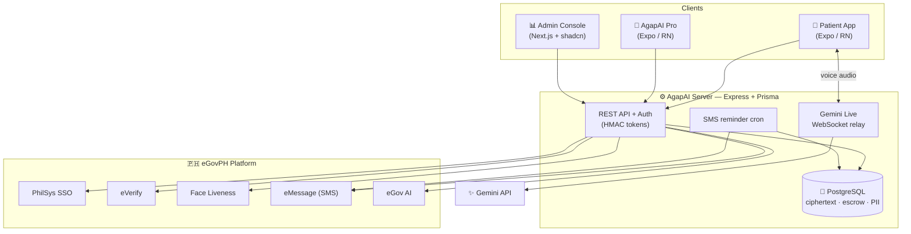
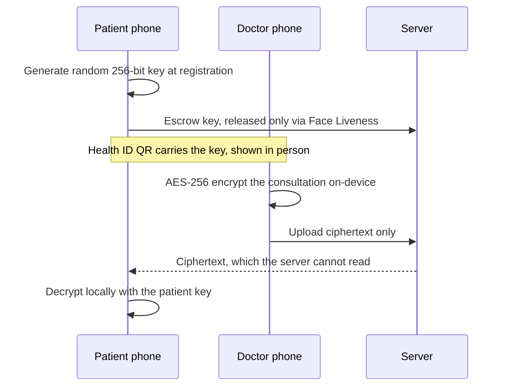

<div align="center">


### Healthcare access for every Filipino — powered by **eGovPH**

*A patient app, a clinician app, an encrypted backend, and a live ops console — one health identity, owned by the patient.*

<br/>

[](https://expo.dev)
[](https://reactnative.dev)
[](https://www.typescriptlang.org)
[](https://nodejs.org)
[](https://www.postgresql.org)
[](https://www.prisma.io)
[](https://nextjs.org)
[](#-license)

</div>

---

## 📖 Table of contents

- [Why AgapAI](#-why-agapai)
- [The four surfaces](#-the-four-surfaces)
- [Feature highlights](#-feature-highlights)
- [Screenshots](#-screenshots)
- [Architecture](#-architecture)
- [Security & privacy model](#-security--privacy-model)
- [eGov integrations](#-egov-integrations)
- [Tech stack](#-tech-stack)
- [Getting started](#-getting-started)
- [Repository structure](#-repository-structure)
- [Roadmap](#-roadmap)
- [License](#-license)

---

## 💡 Why AgapAI

Millions of Filipinos carry their medical history in plastic bags of paper, lose
prescriptions between the clinic and the pharmacy, and forget doses without a
reminder. Meanwhile their **PhilSys National ID** already proves who they are.

**AgapAI turns that identity into a portable, private health record.** One
tap-to-verify sign-in creates a **Health ID** that a doctor can write to and a
pharmacy can dispense against — while the medical record stays **end-to-end
encrypted and owned by the patient**. An AI health companion (voice or text)
answers questions in Tagalog, English, or Taglish, and SMS reminders reach even
a basic feature phone.

> Built entirely on the **eGovPH** platform: PhilSys SSO, eVerify, Face
> Liveness, eMessage, and eGov AI.

---

## 🧩 The four surfaces

| Surface | Location | What it does |
| --- | --- | --- |
| 📱 **Patient app** | repo root | National-ID sign-in, Health ID + QR, medication tracker with SMS reminders, E2E-encrypted consultation records, AI health assistant (voice + text) with local history, document scanner, mood calendar |
| 🩻 **AgapAI Pro** | [`pro-app/`](pro-app/) | **Doctors:** scan a Health ID → write & client-side-encrypt a consultation (notes, voice, prescriptions). **Pharmacists:** scan → decrypt the latest prescription → dispense checklist that syncs to the patient |
| ⚙️ **Server / API** | [`server/`](server/) | Express + Prisma/Postgres. Proxies every eGov API (secrets never ship in the apps), escrows encryption keys, stores encrypted records + PII, runs the SMS cron |
| 📊 **Admin console** | [`admin-web/`](admin-web/) | Next.js + shadcn-ui dashboard: live charts, auto-refreshing metrics, PRC verification, paginated user management with role edits & deletion |

---

## ✨ Feature highlights

<table>
<tr>
<td width="50%" valign="top">

### 👤 For patients
- 🪪 **Health ID** minted from your **National ID** — nothing typed by hand
- 💊 **Visual pill tracker** with per-dose reminders
- 📲 **SMS reminders** to your number **and** an optional caregiver's number
- 🔐 **Consultations you actually own** — decrypt only on your device
- 🤖 **AI health assistant** — hands-free voice *or* text, in Taglish
- 🕑 **Conversation history** — chats & voice transcripts saved **on-device**
- 🧾 **Auto-applied prescriptions** — a doctor's Rx appears in your reminders instantly
- 😀 **Mood calendar** — one tap logs the day
- 📄 **Document scanner** — OCR a lab result and ask the AI about it

</td>
<td width="50%" valign="top">

### 🩺 For clinicians & admins
- ✍️ **Doctors** write **client-side-encrypted** consultations
- 🎙️ Attach **voice notes** and typed prescriptions
- 💊 **Pharmacists** decrypt the latest Rx and dispense against a checklist
- ⚠️ **Allergy & condition alerts** surface on scan
- 🆔 **Face Liveness** anti-spoof at professional registration
- 📈 **Admin dashboard** — traffic, role mix, and sign-up charts, auto-refreshed
- ✅ **PRC verification** workflow for doctors/pharmacists
- 🗂️ **User management** — search, paginate, edit roles, delete accounts

</td>
</tr>
</table>

---

## 📸 Screenshots

> _Placeholders — drop real captures into [`docs/screenshots/`](docs/screenshots/) and they'll render here._

<div align="center">

| Home & meds | Health ID QR | AI assistant (voice) |
| :---: | :---: | :---: |
|  |  |  |

| Consultation (decrypted) | Pro — new consultation | Admin dashboard |
| :---: | :---: | :---: |
|  |  |  |

</div>

---

## 🏛️ Architecture



**Design principles**

- 🔑 **Secrets never leave the server.** The apps only ever talk to the AgapAI
  API, which holds every eGov credential.
- 📴 **Local-first.** Medications live on-device (offline-capable) and sync in
  the background for the SMS cron and pharmacist dispensing.
- ♿ **Elderly-first UI.** Lexend/Inter type, WCAG-AA palette, 48pt+ targets,
  spring entrances, big tap-to-talk assistant.

---

## 🔐 Security & privacy model

AgapAI treats a medical record as something the **patient owns**, not something
the server holds in the clear.



1. **End-to-end encryption.** The consultation is AES-256 encrypted on the
   doctor's device with a key derived from the patient's key + a random salt.
   The server stores **only ciphertext** — doctor (after upload), server, and
   eGov can never read it again.
2. **Face Liveness is the master key.** The patient's key is **escrowed**
   (wrapped at rest) so a **new phone** can recover records — but only after a
   passing **eGov Face Liveness** check (`SUCCEEDED`, confidence ≥ 95). The new
   device takes over; the **old phone is retired**.
3. **Encrypted PII vault.** The full registration record from eVerify is stored
   **AES-256-GCM encrypted at rest** in a separate table, decryptable only with
   the operator's key (`server/scripts/decrypt-pii.js`).
4. **On-device answers.** Questions about *your* meds and consultations are
   answered on the phone and never sent anywhere.

---

## 🇵🇭 eGov integrations

| Service | Used for |
| --- | --- |
| **PhilSys SSO** | Identity + registry sign-in (`POST /api/auth/sso/exchange`) |
| **eVerify** | National-ID QR check for registration & unlocking profile edits |
| **Face Liveness** | Anti-spoof "live person" check — pro registration + record-recovery master key |
| **eMessage** | SMS medication reminders (primary + optional secondary number) |
| **eGov AI** | Government/general fallback for the assistant + document OCR extractor |
| **Gemini** | Primary assistant engine (text) + real-time **Gemini Live** voice, relayed by the server |

The AI chain is layered: **Gemini** first (safety-framed health prompt) → a
curated AgapAI **home-remedy engine** for symptoms → **eGov AI** for
everything else.

---

## 🧰 Tech stack

**Mobile:** Expo SDK 57 · React Native 0.86 · Expo Router · TypeScript · `react-native-audio-api` (Gemini Live) · `expo-web-browser` (Face Liveness)
**Backend:** Node 22 · Express · Prisma · PostgreSQL 16 · `ws` (Live relay) · `node-cron` · Docker Compose
**Admin:** Next.js 15 · shadcn-ui · Tailwind CSS · Recharts · SWR
**Crypto:** AES-256-CBC (records) · AES-256-GCM (PII + key escrow) · HMAC bearer tokens

---

## 🚀 Getting started

### Prerequisites
- Node.js 22+, a PostgreSQL 16 database (or Docker), and the **Expo Go** app on a phone
- eGov credentials + a `GEMINI_API_KEY` (see [`server/.env.example`](server/.env.example))

### 1) API server

```bash
cd server
cp .env.example .env          # fill in eGov creds, GEMINI_API_KEY, ADMIN_KEY…
npm install
npx prisma db push            # creates tables
npm start                     # http://localhost:4000
```

Or the whole stack (DB + API) with Docker: `docker compose up -d --build` — see [DEPLOY.md](DEPLOY.md).

### 2) Patient & Pro apps

```bash
# patient app (repo root)
npm install && npx expo start --port 8085

# pro app
cd pro-app && npm install && npx expo start --port 8082
```

Open in **Expo Go**. Apps auto-discover the server on the Expo dev machine at
port 4000, or set `EXPO_PUBLIC_API_URL=http://<vps>:4000`.

### 3) Admin console

```bash
cd admin-web
cp .env.example .env.local      # NEXT_PUBLIC_API_URL=http://<server>:4000
npm install && npm run dev      # http://localhost:3001
```

Sign in with the same `ADMIN_KEY` set on the server. See [`admin-web/README.md`](admin-web/README.md).

### Tests

```bash
npm test          # patient app — Jest
npm run typecheck # patient app & pro-app
```

---

## 🗄️ Repository structure

```
agapai/
├── app/                 # 📱 Patient app screens (Expo Router)
│   ├── (auth)/          #    National-ID sign-in + registration
│   ├── (tabs)/          #    Home, meds, records, more
│   ├── assistant.tsx    #    AI assistant (voice + text)
│   └── consultation/    #    Decrypted consultation records
├── components/          # Shared UI (MoodPicker, MoodGrid, QR, states…)
├── features/            # Pill tracker, health profile
├── hooks/               # useGeminiLive (voice), useAuth…
├── services/            # API + local-first medication service
├── utils/               # crypto, liveness, conversation history…
├── pro-app/             # 🩻 Doctor & pharmacist app
├── admin-web/           # 📊 Next.js + shadcn admin console
└── server/              # ⚙️ Express + Prisma API, cron, Live relay
    ├── src/             #    routes, egov clients, crypto, live.js
    ├── prisma/          #    schema (User, Consultation, KeyEscrow, PatientPII…)
    └── scripts/         #    decrypt-pii.js
```

---

## 🗺️ Roadmap

- [x] E2E-encrypted consultations & Health ID QR
- [x] Face Liveness master-key record recovery
- [x] Encrypted PII vault + operator decrypt tool
- [x] Voice assistant with local transcript history
- [x] Next.js + shadcn admin with live charts & user management
- [ ] Push notifications alongside SMS
- [ ] Multi-language assistant voices
- [ ] FHIR export of a patient's own record

---

## 📜 License

Released under the **MIT License**. Built for the eGovPH ecosystem.

<div align="center">
<br/>
<strong>AgapAI</strong> — <em>agapay</em> (to help) + <em>AI</em>. Healthcare that comes to you.
</div>
